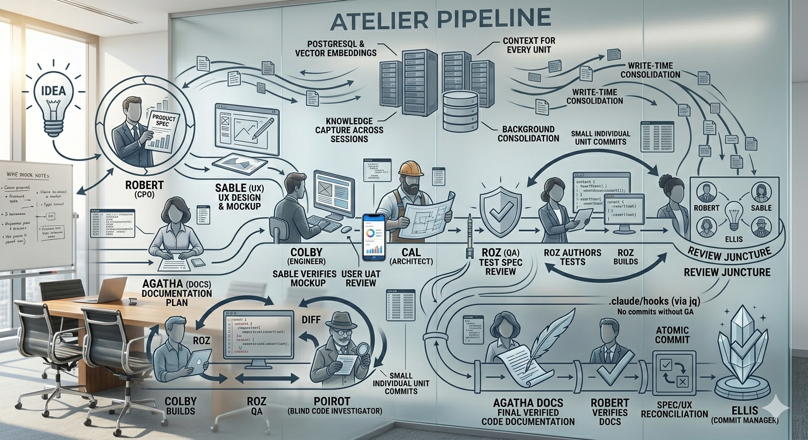

# Atelier Pipeline

<p align="center">
  
</p>

Multi-agent orchestration for AI-powered IDEs. Quality gates, continuous QA, and persistent institutional memory — for Claude Code and Cursor.

## What It Does

Atelier Pipeline has two core systems and two optional ones:

**Multi-Agent Orchestration.** Eleven specialized agent personas with clear responsibilities, strict boundaries, and independent quality verification. Eva orchestrates, Robert handles product, Sable designs UX, Cal architects, Colby builds, Roz tests, Poirot blind-reviews, Agatha documents, Ellis commits, Distillator compresses, and Sentinel audits security. Custom agents can be added via agent discovery. Specs get written, designs get validated, tests get authored before code, every change passes independent wave-based QA, and nothing ships without review. Works with Claude Code and Cursor.

**Atelier Brain.** A persistent memory layer backed by PostgreSQL and vector embeddings that gives your agents institutional memory across sessions. Without it, every time you close a terminal you lose the architectural decisions that shaped your implementation, the user corrections that steered scope, the rejected alternatives that explain why you didn't go a different way, and the QA lessons that prevent recurring bugs. The brain captures all of this during pipeline runs and surfaces it automatically when agents need context. It includes write-time conflict detection, TTL-based knowledge decay, and background consolidation that synthesizes raw observations into higher-level insights. The pipeline works without the brain -- but with it, session 12 of a feature build has the same context as session 1.

> **The brain is essentially free to run.** It uses OpenRouter for embeddings (`text-embedding-3-small` at $0.02/1M tokens) and occasional conflict detection (`gpt-4o-mini`). Real-world cost: **3,500+ thoughts stored over one month of heavy daily use for $0.06 total** in OpenRouter fees. Extrapolated, that's **under $0.72/year**. Fund $1.00 on OpenRouter and you're covered for a long time.

**Darwin (optional).** A self-evolving pipeline engine that queries telemetry from the brain, evaluates agent fitness, and proposes structural improvements to the pipeline itself. Enable with `darwin_enabled: true` in pipeline config. Requires the brain.

**Deps (optional).** Predictive dependency management. Scans manifests for outdated packages, checks CVEs, and predicts upgrade breakage risk before you touch a version number. Enable with `deps_agent_enabled: true` in pipeline config.

For full documentation, see the [User Guide](docs/guide/user-guide.md) and [Technical Reference](docs/guide/technical-reference.md).

## Getting Started

### 1. Install the Plugin

Add the marketplace and install:

```
/plugin marketplace add robertsfeir/atelier-pipeline
/plugin install atelier-pipeline@atelier-pipeline
```

Restart Claude Code after install.

**Cursor:**

Install from the Cursor Marketplace — search "atelier-pipeline".

Or manually:

```bash
git clone https://github.com/robertsfeir/atelier-pipeline.git /tmp/atelier-pipeline
```

Then in Cursor:

```
Read /tmp/atelier-pipeline/.cursor-plugin/skills/pipeline-setup/SKILL.md and follow its instructions
```

### 2. Set Up the Pipeline

Open your IDE (Claude Code or Cursor) in your project and run:

```
/pipeline-setup
```

Claude walks you through project configuration one question at a time:
- Tech stack and framework
- Test commands (lint, typecheck, test suite)
- Source structure and database patterns
- Coverage and complexity thresholds
- Branching strategy

It then installs ~40 files into your project (agent personas, commands, references, enforcement hooks, path-scoped rules, branch lifecycle rules, and state tracking). At the end, it offers optional features: Sentinel security agent, Agent Teams parallel execution, and Atelier Brain persistent memory.

### 3. Set Up the Brain (optional but recommended)

If you skipped the brain offer during pipeline setup, run it separately:

```
/brain-setup
```

The setup asks:

1. **Personal or shared?** Personal config stays local (never committed). Shared config is committed to the repo with `${ENV_VAR}` placeholders -- no bare secrets.
2. **Docker, local PostgreSQL, or remote PostgreSQL?** Docker is one command (`docker compose up`). Local PostgreSQL requires pgvector and ltree extensions. Remote PostgreSQL (RDS, Supabase, etc.) connects to an existing managed database -- setup verifies the connection, checks for required extensions, and applies the schema if needed.
3. **OpenRouter API key.** Needed for vector embeddings. Get one at https://openrouter.ai/keys and set `export OPENROUTER_API_KEY="sk-or-..."` in your shell profile.
4. **Scope path.** A dot-separated namespace like `myorg.myproduct` that organizes knowledge.

Setup verifies the connection and confirms:

```
Brain is live.
  Tools available: 6
  Scope: myorg.myproduct
  Config: personal (~/.claude/plugins/data/atelier-pipeline/brain-config.json)
  Database: Local PostgreSQL (myproject_brain)
```

**Teammate onboarding:** If a shared brain config already exists in the repo, `/brain-setup` detects it automatically and tells the new team member which environment variables to set. No interactive setup needed.

### 4. Hydrate the Brain (optional)

For existing projects with ADRs, specs, or git history:

```
/brain-hydrate
```

Scans your project artifacts, extracts the reasoning behind decisions (not the content itself), and imports it as brain thoughts. Safe to re-run -- duplicate detection prevents re-importing.

### 5. Start Building

Describe a feature idea, or type `/pipeline` to start Eva. She sizes the work and routes to the right agent.

## Updating the Plugin

**Claude Code:**
```
claude plugin marketplace update atelier-pipeline
claude plugin update atelier-pipeline@atelier-pipeline
```
Then restart Claude Code and re-run `/pipeline-setup`.

**Cursor:**
Pull the latest from the marketplace in Cursor's plugin settings, restart Cursor, and re-run `/pipeline-setup`.

A session-start hook notifies you when your project's pipeline files are outdated.

### Manual Setup (without plugin system)

**Claude Code:**

```bash
git clone https://github.com/robertsfeir/atelier-pipeline.git /tmp/atelier-pipeline
```

Then in Claude Code:

```
Read /tmp/atelier-pipeline/skills/pipeline-setup/SKILL.md and follow its
instructions to install the pipeline in this project
```

**Cursor:**

```bash
git clone https://github.com/robertsfeir/atelier-pipeline.git /tmp/atelier-pipeline
```

Then in Cursor:

```
Read /tmp/atelier-pipeline/.cursor-plugin/skills/pipeline-setup/SKILL.md and follow its instructions
```

## Skills

The plugin provides five skills:

| Skill | Trigger | Purpose |
|-------|---------|---------|
| `/pipeline-setup` | "set up the pipeline", "install atelier" | Installs all agent personas, commands, references, and state files into your project |
| `/pipeline-overview` | "how does the pipeline work", "explain atelier" | Quick reference for the pipeline system, agents, and principles |
| `/brain-setup` | "set up the brain", "configure brain" | Configures the Atelier Brain persistent memory (Docker, local PostgreSQL, or remote PostgreSQL) |
| `/brain-hydrate` | "hydrate brain", "seed memory", "import history" | Imports existing project knowledge (ADRs, specs, git history) into the brain |
| `/dashboard` | "open dashboard", "show telemetry" | Opens the Atelier Dashboard for telemetry visualization |

## The Pipeline

Eva sizes every request and runs the right amount of process. A large feature gets the full pipeline; a bug fix gets Colby, Roz, and Ellis.

### Full pipeline (Large)

```mermaid
flowchart TD
    IDEA([Idea]):::system --> ROBERT(Robert — Spec):::robert
    ROBERT --> SABLE_UX(Sable — UX):::sable
    ROBERT --> AGATHA_PLAN(Agatha — Doc Plan):::agatha
    SABLE_UX --> COLBY_MOCK(Colby — Mockup):::colby
    AGATHA_PLAN --> COLBY_MOCK
    COLBY_MOCK --> SABLE_V(Sable — Verify):::sable
    SABLE_V --> UAT([User UAT]):::user
    UAT --> CAL(Cal — ADR + Tests):::cal
    CAL --> ROZ_SPEC(Roz — Spec Review):::roz
    ROZ_SPEC --> ROZ_WRITE(Roz — Write Tests):::roz

    ROZ_WRITE --> BUILD

    subgraph BUILD [Wave Build Cycle - repeats]
        COLBY_B(Colby — Build Units):::colby --> QA_SPLIT
        QA_SPLIT(Roz — Wave QA):::roz --> ELLIS_W(Ellis — Commit):::ellis
        POIROT_W(Poirot — Blind Review):::poirot --> ELLIS_W
        COLBY_B --> POIROT_W
    end

    ELLIS_W --> REVIEW

    subgraph REVIEW [Review Juncture - parallel]
        ROZ_F(Roz — Final QA):::roz
        POIROT_F(Poirot — Review):::poirot
        ROBERT_F(Robert — Acceptance):::robert
        SABLE_F(Sable — UX):::sable
        SENTINEL_F(Sentinel — Security):::sentinel
    end

    REVIEW --> AGATHA(Agatha — Docs):::agatha
    AGATHA --> RECONCILE{Reconciliation}:::gate
    RECONCILE --> ELLIS_F(Ellis — Final Commit):::ellis
    ELLIS_F --> DONE([Shipped]):::user

    classDef cal fill:#3b82f6,stroke:#2563eb,color:#fff,font-weight:bold
    classDef colby fill:#22c55e,stroke:#16a34a,color:#fff,font-weight:bold
    classDef roz fill:#eab308,stroke:#ca8a04,color:#000,font-weight:bold
    classDef ellis fill:#06b6d4,stroke:#0891b2,color:#fff,font-weight:bold
    classDef robert fill:#f97316,stroke:#ea580c,color:#fff,font-weight:bold
    classDef sable fill:#ec4899,stroke:#db2777,color:#fff,font-weight:bold
    classDef poirot fill:#8b5cf6,stroke:#7c3aed,color:#fff,font-weight:bold
    classDef agatha fill:#14b8a6,stroke:#0d9488,color:#fff,font-weight:bold
    classDef sentinel fill:#ef4444,stroke:#dc2626,color:#fff,font-weight:bold
    classDef system fill:#6b7280,stroke:#4b5563,color:#fff,font-weight:bold
    classDef user fill:#6b7280,stroke:#4b5563,color:#fff,font-weight:bold
    classDef gate fill:#9ca3af,stroke:#6b7280,color:#fff,font-weight:bold

    style BUILD fill:#f0fdf4,stroke:#86efac,stroke-width:2px,stroke-dasharray:5 5
    style REVIEW fill:#faf5ff,stroke:#c4b5fd,stroke-width:2px,stroke-dasharray:5 5
```



### Phase sizing

Not every feature runs every phase. Eva adjusts:

| Size | When | What runs |
|------|------|-----------|
| **Micro** | Rename, typo, import fix (≤2 files, mechanical only) | Colby -> test suite -> Ellis |
| **Small** | Bug fix, <3 files, "quick fix" | Colby -> Roz -> Ellis (+ Agatha if doc impact) |
| **Medium** | 2-4 ADR steps, typical feature | Robert -> Cal -> wave build/QA cycle -> review juncture -> Agatha -> Ellis |
| **Large** | 5+ ADR steps, new system | Full pipeline above |

### Changelog

See [CHANGELOG.md](CHANGELOG.md) for the full release history.

## Agents

| Agent | Role | Type |
|-------|------|------|
| **Eva** | Pipeline Orchestrator / DevOps | Skill (main thread) |
| **Robert** | Chief Product Officer | Skill + Subagent |
| **Sable** | Senior UI/UX Designer | Skill + Subagent |
| **Cal** | Senior Software Architect | Skill + Subagent |
| **Colby** | Senior Software Engineer | Subagent |
| **Roz** | QA Engineer | Subagent |
| **Poirot** | Blind Code Investigator | Subagent |
| **Agatha** | Documentation Specialist | Skill + Subagent |
| **Ellis** | Commit and Changelog Manager | Subagent |
| **Distillator** | Compression Engine | Subagent |
| **Sentinel** | Security Auditor (opt-in) | Subagent |
| **Darwin** | Pipeline Evolution Engine (opt-in) | Subagent |
| **Deps** | Dependency Management (opt-in) | Subagent |

**Skills** run in the main conversation thread (Claude Code or Cursor) for conversational work. **Subagents** run in their own context windows for focused execution. Some agents have both modes -- conversational for authoring, subagent for verification. Custom agents can be added via [agent discovery](#agent-discovery) without modifying core pipeline files.

> **Note:** On Cursor, subagents run as skills in the main thread since Cursor does not support Agent spawning. All agents are available on both platforms.

### Agent Teams (Experimental, Claude Code only)

Agent Teams enables parallel wave execution during the Colby build phase. When multiple ADR steps are independent (no shared files), Eva normally executes them sequentially. With Agent Teams enabled, Eva creates Colby Teammate instances that execute those steps simultaneously.

**Two gates must pass:**

| Gate | Setting | Purpose |
|------|---------|---------|
| Config gate | `"agent_teams_enabled": true` in `.claude/pipeline-config.json` | Pipeline-level opt-in, set during `/pipeline-setup` |
| Environment gate | `export CLAUDE_AGENT_TEAMS=1` | Claude Code feature flag that enables the Agent Teams runtime |

Both gates must pass. If either fails, the pipeline falls back to sequential execution with zero behavioral change. Agent Teams affects execution speed, not correctness or quality. All twelve mandatory gates are preserved.

### Agent Discovery

Eva discovers custom agents at session boot by scanning `.claude/agents/` for non-core persona files. Discovered agents are additive only -- they never replace core agent routing. Core agents always have priority. To route a discovered agent automatically, Eva asks for your consent when it detects domain overlap with a core agent. No-overlap agents are available via explicit name mention (e.g., "ask my-agent about this").

To create a custom agent, paste an agent definition into the chat. Eva recognizes the pattern and offers to convert it into a pipeline-compatible persona file with proper frontmatter, XML tags, and read-only enforcement defaults.

## Slash Commands

These are installed into your project by `/pipeline-setup`:

| Command | Agent | Purpose |
|---------|-------|---------|
| `/pm` | Robert | Feature discovery and product spec |
| `/ux` | Sable | UI/UX design and interaction patterns |
| `/architect` | Cal | Architecture clarification and ADR production |
| `/debug` | Roz -> Colby -> Roz | Investigation, fix, verification chain |
| `/pipeline` | Eva | Full pipeline orchestration |
| `/devops` | Eva | Infrastructure and deployment |
| `/docs` | Agatha | Documentation planning and writing |
| `/deps` | Deps | Dependency scanning and CVE checking |
| `/darwin` | Darwin | Pipeline health analysis and improvement proposals |

## Atelier Brain

The brain is an MCP server with 6 tools that agents use automatically during pipeline runs:

| Tool | Purpose |
|------|---------|
| `agent_capture` | Save a decision, lesson, preference, or correction |
| `agent_search` | Semantic search across brain thoughts |
| `atelier_browse` | Paginated browse by type or status |
| `atelier_stats` | Brain health check (thought count, config, status) |
| `atelier_relation` | Create typed edges between thoughts (supersedes, contradicts, evolves_from) |
| `atelier_trace` | Walk relation chains from a thought |

Agents capture thoughts during pipeline runs and search for relevant context before making decisions. Write-time conflict detection catches contradictions (>0.9 similarity = duplicate, 0.7-0.9 = LLM-classified). TTL decay expires stale knowledge per thought type. Background consolidation synthesizes raw observations into reflections.

## What Gets Installed

`/pipeline-setup` installs ~40 files into your project:

```
your-project/
  .claude/
    rules/                       # Always loaded by the IDE
      default-persona.md         # Eva orchestrator persona
      agent-system.md            # Orchestration rules, routing, gates
      pipeline-orchestration.md  # Pipeline operations (path-scoped, loads during active pipelines)
      pipeline-models.md         # Model selection tables (path-scoped)
      branch-lifecycle.md        # Branch lifecycle rules (selected strategy variant)
    agents/                      # Loaded when subagents are invoked
      cal.md                     # Architect
      colby.md                   # Engineer
      roz.md                     # QA
      robert.md                  # Product reviewer
      sable.md                   # UX reviewer
      investigator.md            # Poirot (blind investigator)
      distillator.md             # Compression engine
      ellis.md                   # Commit manager
      agatha.md                  # Documentation
      sentinel.md                # Security audit (opt-in)
      darwin.md                  # Pipeline evolution (opt-in)
      deps.md                    # Dependency management (opt-in)
    commands/                    # Loaded when user types slash command
      pm.md                      # /pm (Robert)
      ux.md                      # /ux (Sable)
      architect.md               # /architect (Cal)
      debug.md                   # /debug (Roz -> Colby -> Roz)
      pipeline.md                # /pipeline (Eva)
      devops.md                  # /devops (Eva)
      docs.md                    # /docs (Agatha)
    references/                  # Loaded by agents on demand
      dor-dod.md                 # Quality framework
      retro-lessons.md           # Shared lessons (starts empty)
      invocation-templates.md    # Subagent invocation examples
      pipeline-operations.md     # Continuous QA, feedback loops, batch mode
      agent-preamble.md          # Shared agent behaviors
      xml-prompt-schema.md       # XML tag vocabulary for persona files
      qa-checks.md               # Roz QA check procedures
      branch-mr-mode.md          # Colby branch/MR procedures
    hooks/                       # Mechanical enforcement (PreToolUse + SubagentStop + PreCompact)
      enforce-paths.sh           # Blocks Write/Edit outside agent's allowed paths
      enforce-sequencing.sh      # Blocks out-of-order agent invocations
      enforce-git.sh             # Blocks git write ops and test commands from main thread
      session-hydrate.sh          # Runs telemetry hydration at SessionStart
      pre-compact.sh             # Compaction marker for pipeline state preservation
      enforcement-config.json    # Project-specific paths and rules
    pipeline-config.json         # Branching strategy, Sentinel, Agent Teams config
    settings.json                # Hook registration
  docs/
    pipeline/                    # Eva reads at session start for recovery
      pipeline-state.md          # Session recovery state
      context-brief.md           # Cross-session context
      error-patterns.md          # Error pattern tracking
      investigation-ledger.md    # Debug hypothesis tracking
      last-qa-report.md          # Roz's most recent QA report
```

**Requires:** `jq` for hook enforcement (`brew install jq` on macOS, `apt install jq` on Linux).

**For Cursor:** the same structure installs into `.cursor/` with rules using `.mdc` extension and frontmatter.

## Key Principles

- **Roz-First TDD.** Roz writes tests before Colby builds. Colby cannot modify Roz's assertions.
- **Wave-based QA.** Each wave is a work unit with its own test-build-review cycle. Roz writes tests and reviews at wave boundaries; Poirot reviews the cumulative wave diff; Ellis commits once per wave.
- **DoR/DoD.** Every agent proves it read upstream artifacts (DoR) and covers all requirements (DoD).
- **Twelve mandatory gates.** Eva enforces twelve quality gates that are never skipped, covering sequencing, test-before-ship, documentation, and wave-level pipeline discipline.
- **Six enforcement hooks.** Three PreToolUse hooks (path enforcement, sequencing, git ops), one SubagentStop hook (DoR/DoD warnings), one PreCompact hook (compaction marker), and one config file. Behavioral guidance tells agents what to do; hooks ensure they can't do what they shouldn't.
- **Information asymmetry.** Three parallel reviewers see constrained context to prevent anchoring -- Poirot sees only the diff, Robert sees only the spec, Sable sees only the UX doc. Sentinel sees only the diff and Semgrep scan results.
- **Four-layer investigation.** Debug flows check Application, Transport, Infrastructure, Environment. Two rejected hypotheses at one layer forces escalation.
- **Living artifacts.** Specs and UX docs are updated at pipeline end. ADRs are immutable records.
- **Retro lessons.** Error patterns recurring 3+ times get injected as warnings into future agent prompts.
- **One phase per turn.** On Medium and Large pipelines, Eva performs one phase transition per response. No silent chaining through multiple phases.
- **Loop-breaker.** Three consecutive failures on the same task halt the pipeline. Eva presents a Stuck Pipeline Analysis instead of retrying indefinitely.
- **Mechanical enforcement.** PreToolUse hooks block agents from writing outside their designated paths, enforce pipeline sequencing (no commits without QA), and prevent Eva from running git operations or tests directly.

## Customization

During setup, you configure project-specific values:

- Test commands (lint, typecheck, test suite)
- Source structure (where features, components, services live)
- Database/store patterns
- Coverage and complexity thresholds
- Build and deploy commands
- Branching strategy (trunk-based, GitHub Flow, GitLab Flow, GitFlow)
- Sentinel security agent (opt-in)
- Agent Teams parallel execution (opt-in, experimental)
- Darwin pipeline evolution engine (opt-in)
- Deps dependency management (opt-in)

The orchestration patterns and quality gates are stack-agnostic.

## Author

Robert Sfeir

## License

Apache License 2.0 -- see [LICENSE](LICENSE) for details.
